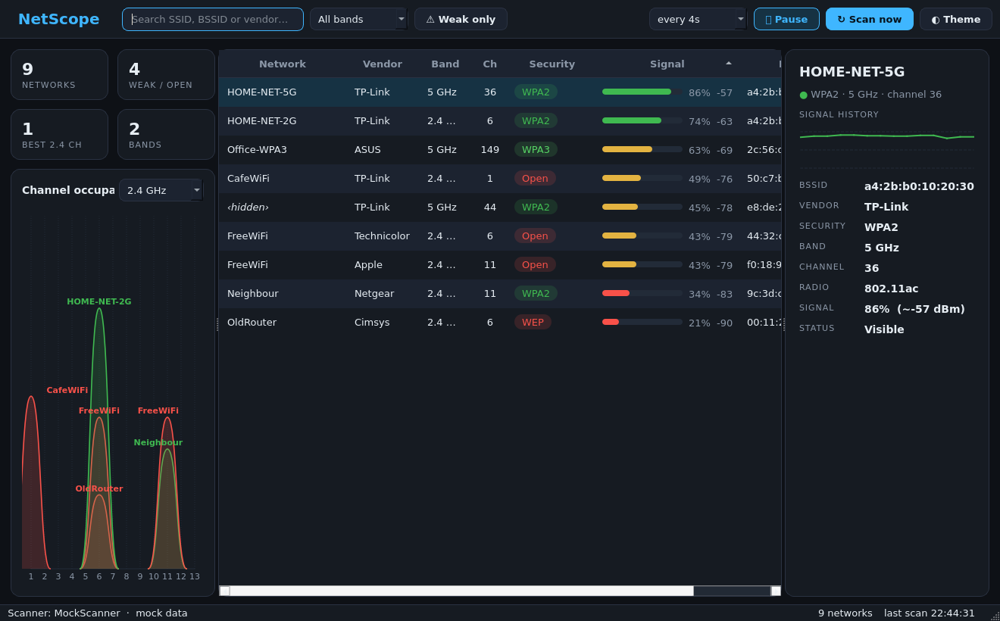
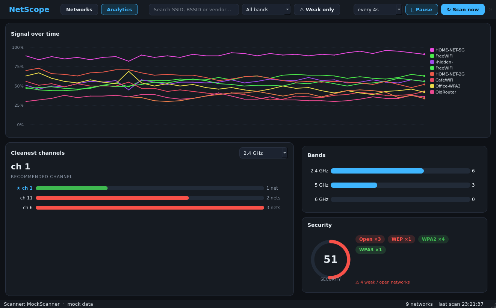
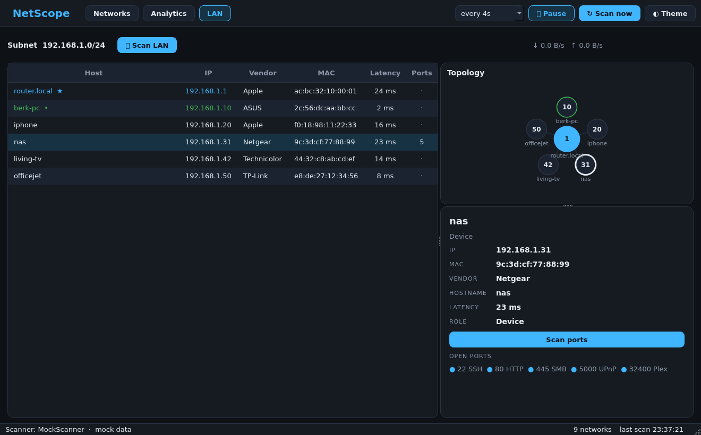
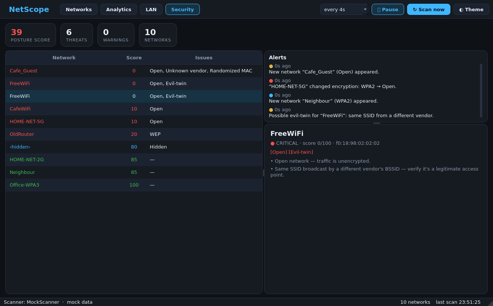
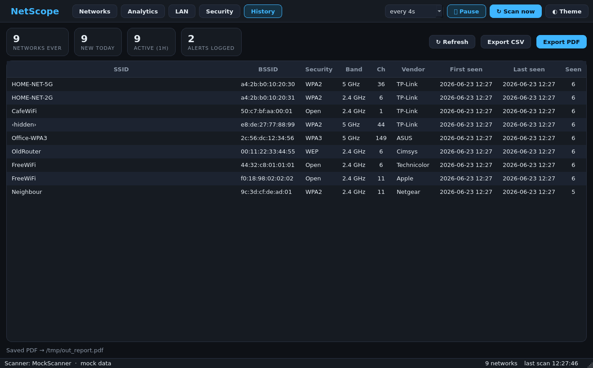
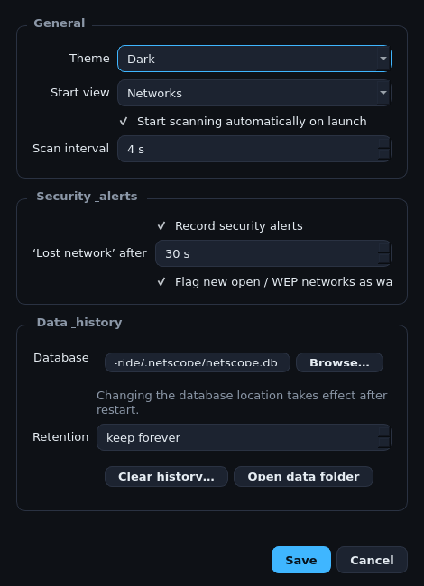

<div align="center">


# NetScope

**Nearby Wi-Fi monitoring, analysis & defensive security — for Windows desktop.**

A fast, dark-first PySide6 app that scans the Wi-Fi around you, charts it over
time, maps the devices on your own network, flags security risks, and keeps a
searchable history you can export.



</div>

---

> **Scope & ethics.** NetScope is a **defensive, diagnostic** tool. It passively
> observes Wi-Fi access points in range (like any Wi-Fi analyzer) and performs
> active inspection (ping sweep, port scan) **only on the network you're
> connected to / authorized to test**. It does **not** crack passwords, capture
> handshakes, deauth/jam, or intercept anyone else's traffic — and never will.

## Features

- **Networks** — live access-point list with real RSSI (dBm) via the native
  Windows WLAN API, color-coded security, painted signal bars, search, band and
  "weak only" filters, and a per-network detail panel with a live signal sparkline.
- **Analytics** — multi-network signal-over-time chart, per-band channel
  congestion leaderboard with a recommended channel, band distribution, and an
  airspace security score.
- **LAN** — discover devices on your own subnet (ping sweep + ARP), real vendor
  names from the **full IEEE OUI registry**, on-demand TCP port/service scan, a
  topology map, and a live bandwidth readout.
- **Security** — evil-twin / rogue-AP detection, per-network security scoring with
  anomaly badges (Open / WEP / Hidden / Randomized-MAC / Unknown-vendor), and a
  live alerts timeline (new / lost / encryption-changed / evil-twin).
- **History** — persistent SQLite store across runs, lifetime stats, and one-click
  **CSV / PDF** report export.
- **Settings** — theme, start view, scan interval, alert behaviour, data retention —
  saved to `~/.netscope/config.json`.

Light and dark themes throughout. Locale-resilient (works on a Turkish Windows, etc.).

## Screenshots

| Analytics | LAN / Devices |
|---|---|
|  |  |

| Security | History |
|---|---|
|  |  |

<div align="center"></div>

## Run from source

```bash
pip install -r requirements.txt

python gui.py            # real scanner on Windows, mock data elsewhere
python gui.py --mock     # force mock data (great for development on any OS)
```

> The real scanner is Windows-only (native WLAN API + netsh fallback). On other
> platforms the app runs against realistic **mock** data, so the UI and analysis
> are fully usable for development.

## Build a Windows executable

NetScope ships as a single `.exe` (no Python needed to run it):

```bat
packaging\build_windows.bat
```

This produces `dist\NetScope.exe` via PyInstaller (bundling the IEEE OUI database
and icon) and, if [Inno Setup](https://jrsoftware.org/isdl.php) is installed,
`dist\NetScope-Setup.exe`. See [`packaging/README.md`](packaging/README.md).

## Tests

```bash
pytest -q          # 65 unit tests across all subsystems
```

The architecture is deliberately layered — scanners, models, analysis, persistence
and reporting are all UI-independent and pure where possible, which is what keeps
them unit-testable without Wi-Fi hardware or a network.

## Project layout

```
gui.py                 # desktop UI entry point
run.py                 # CLI preview entry point
netscope/
  models.py            # AccessPoint, Band, Security
  utils.py             # MAC / vendor (real IEEE OUI) / band / security helpers
  config.py            # user preferences (JSON)
  store.py             # SQLite persistence
  report.py            # CSV / HTML / PDF report builders
  data/oui.tsv.gz      # bundled IEEE OUI registry (~35k vendors)
  scanners/            # mock / native WLAN API / netsh backends
  lan/                 # device discovery, port scan, traffic monitor
  ui/                  # PySide6 views: networks, analytics, lan, security,
                       # history, settings + threading + theming
tests/                 # pytest suite
packaging/             # PyInstaller spec, build script, Inno Setup installer, icon
```

## Tech

Python 3.10+ · PySide6 (Qt) · SQLite (stdlib) · ctypes (native WLAN API) ·
optional `psutil` for instant bandwidth · PyInstaller for packaging.

## License

[MIT](LICENSE) © 2026 Berk Aslan
